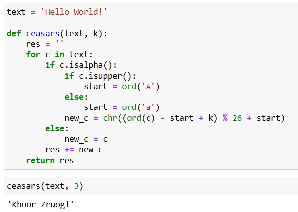
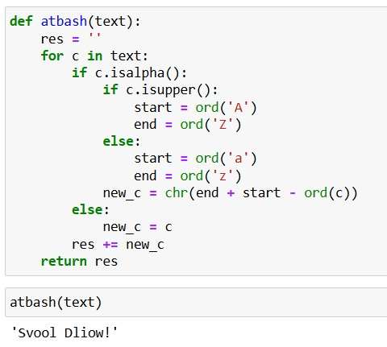

---
## Front matter
title: "Первая лабораторная работа. Шифры простой замены"
subtitle: "НПИмд-01-23"
author: "Бармина Ольга Константиновна"

## Generic otions
lang: ru-RU
toc-title: "Содержание"

## Pdf output format
toc: true # Table of contents
toc-depth: 2
lof: true # List of figures
lot: true # List of tables
fontsize: 12pt
linestretch: 1.5
papersize: a4
documentclass: scrreprt
## I18n polyglossia
polyglossia-lang:
  name: russian
  options:
	- spelling=modern
	- babelshorthands=true
polyglossia-otherlangs:
  name: english
## I18n babel
babel-lang: russian
babel-otherlangs: english
## Fonts
mainfont: PT Serif
romanfont: PT Serif
sansfont: PT Sans
monofont: PT Mono
mainfontoptions: Ligatures=TeX
romanfontoptions: Ligatures=TeX
sansfontoptions: Ligatures=TeX,Scale=MatchLowercase
monofontoptions: Scale=MatchLowercase,Scale=0.9
## Biblatex
biblatex: true
biblio-style: "gost-numeric"
biblatexoptions:
  - parentracker=true
  - backend=biber
  - hyperref=auto
  - language=auto
  - autolang=other*
  - citestyle=gost-numeric
## Pandoc-crossref LaTeX customization
figureTitle: "Рис."
tableTitle: "Таблица"
listingTitle: "Листинг"
lofTitle: "Список иллюстраций"
lotTitle: "Список таблиц"
lolTitle: "Листинги"
## Misc options
indent: true
header-includes:
  - \usepackage{indentfirst}
  - \usepackage{float} # keep figures where there are in the text
  - \floatplacement{figure}{H} # keep figures where there are in the text
---

# Цель работы

Цель данной работы - ознакомиться с шифрами простой замены: шифр Цезаря и шифр Атбаш, а также научиться применять их на практике.

# Задание

1. Реализовать шифр Цезаря с произвольным ключом k
2. Реализовать шифр Атбаш

# Теоретическое введение

Шифр Цезаря - это моноалфавитная подстановка, т.е каждой букве открытого текста ставится в соответствие одна буква шифртекста. 
Шифр Цезаря — это вид шифра подстановки, в котором каждый символ в открытом тексте заменяется символом, находящимся на некотором постоянном числе позиций левее или правее него в алфавите. Например, в шифре со сдвигом вправо на 3, А была бы заменена на Г, Б станет Д, и так далее.

Шифр назван в честь римского полководца Гая Юлия Цезаря, использовавшего его для секретной переписки со своими генералами.

Атбаш — простой шифр подстановки для алфавитного письма. Правило шифрования состоит в замене i-й буквы алфавита буквой с номером n-i+1, где n — число букв в алфавите.

# Выполнение лабораторной работы

1. Произведено ознакомление с шифрами Цезаря и Атбаш по методическим материалам курса

2. Прописан код для шифра Цезаря на языке программирования Python. Код для англоязычных сообщений. Сначала определяем, является ли символ буквой, затем проверяем на верхний и нижний регистр. После этого по формуле определяем символ, полученный в результате сдвига элемента на значение k. Символы, не являющиеся буквами, остаются неизменными. Выводим на экран результат применения шифра Цезаря для произвольного текста со сдвигом на значение k = 3.

{#fig:001 width=70%}

4. Прописан код для шифра Атбаш на языке программирования Python. Код для англоязычных сообщений. Сначала определяем, является ли символ буквой, затем проверяем на верхний и нижний регистр. После этого по формуле определяем символ, полученный в результате отзеркаливание элемента. Символы, не являющиеся буквами, остаются неизменными. Выводим на экран результат применения шифра Атбаш.

{#fig:003 width=70%}

# Выводы

В рамках данной лабораторной работы было произведено ознакомление с шифром Цезаря и шифром Атбаш.
Оба шифра были реализованы на языке программирования Python.

# Список литературы

1. Методические материалы курса
