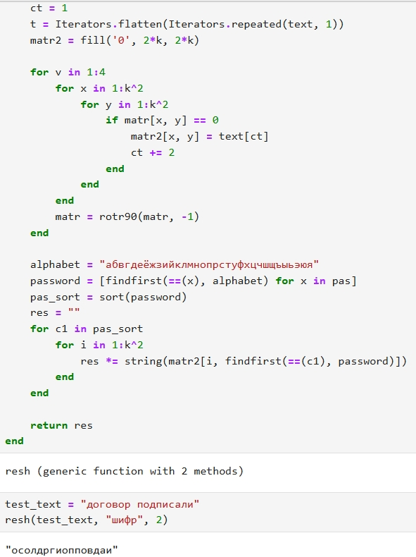

---
# Front matter
lang: ru-RU
title: Защита лабораторной работы №2. Шифры перестановки
author: "Бармина Ольга"
group: НПИмд-01-23
institute: RUDN University, Moscow, Russian Federation
date: 2024 Sep 21th

# Formatting
toc: false
slide_level: 2
header-includes: 
 - \metroset{progressbar=frametitle,sectionpage=progressbar,numbering=fraction}
 - '\makeatletter'
 - '\makeatother'
aspectratio: 43
section-titles: true
theme: metropolis

---

# Результат выполнения лабораторной работы №2

## Цель выполнения лабораторной работы 

Цель данной работы - ознакомиться с шифрами перестановки: маршрутное шифрование, шифрование с помощью решеток и таблица Вижинера, а также научиться применять их на практике.

## Результат выполнения лабораторной работы

Прописан код для маршрутного шифрования на языке программирования Julia.

{#fig:001 width=50%}

## Результат выполнения лабораторной работы

Прописан код для шифрования с помощью решеток на языке программирования Python.

{#fig:003 width=30%}

## Результат выполнения лабораторной работы

Продолжение кода. Выводим на экран результат применения.

{#fig:004 width=30%}

## Результат выполнения лабораторной работы

Прописан код для использования таблицы Вижинера.

{#fig:005 width=40%}

## Вывод 

В рамках данной лабораторной работы было произведено ознакомление с маршрутным шифрованием, шифрованием с помощью решеток и таблицей Вижинера.
Шифры были реализованы на языке программирования Julia.