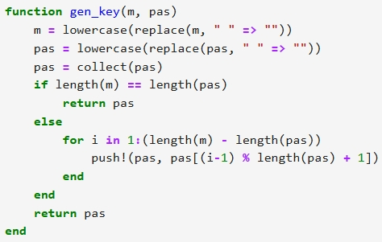
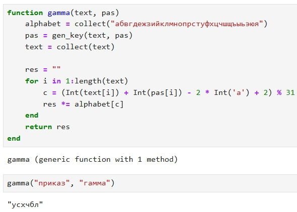

---
# Front matter
title: "Отчет по лабораторной работе №3"
subtitle: "Шифрование гаммированием"
author: "Бармина Ольга Константиновна"
institute: Российский университет дружбы народов, Москва, Россия
date: 2024 September 7th

# Generic otions
lang: ru-RU
toc-title: "Содержание"

# Pdf output format
toc: true # Table of contents
toc_depth: 2
lof: true # List of figures
fontsize: 12pt
linestretch: 1.5
papersize: a4
documentclass: scrreprt
### Fonts
mainfont: PT Serif
romanfont: PT Serif
sansfont: PT Sans
monofont: PT Mono
mainfontoptions: Ligatures=TeX
romanfontoptions: Ligatures=TeX
sansfontoptions: Ligatures=TeX,Scale=MatchLowercase
monofontoptions: Scale=MatchLowercase,Scale=0.9
## Biblatex
biblatex: true
biblio-style: "gost-numeric"
biblatexoptions:
  - parentracker=true
  - backend=biber
  - hyperref=auto
  - language=auto
  - autolang=other*
  - citestyle=gost-numeric
## Misc options
indent: true
header-includes:
  - \linepenalty=10 # the penalty added to the badness of each line within a paragraph (no associated penalty node) Increasing the value makes tex try to have fewer lines in the paragraph.
  - \interlinepenalty=0 # value of the penalty (node) added after each line of a paragraph.
  - \hyphenpenalty=50 # the penalty for line breaking at an automatically inserted hyphen
  - \exhyphenpenalty=50 # the penalty for line breaking at an explicit hyphen
  - \binoppenalty=700 # the penalty for breaking a line at a binary operator
  - \relpenalty=500 # the penalty for breaking a line at a relation
  - \clubpenalty=150 # extra penalty for breaking after first line of a paragraph
  - \widowpenalty=150 # extra penalty for breaking before last line of a paragraph
  - \displaywidowpenalty=50 # extra penalty for breaking before last line before a display math
  - \brokenpenalty=100 # extra penalty for page breaking after a hyphenated line
  - \predisplaypenalty=10000 # penalty for breaking before a display
  - \postdisplaypenalty=0 # penalty for breaking after a display
  - \floatingpenalty = 20000 # penalty for splitting an insertion (can only be split footnote in standard LaTeX)
  - \raggedbottom # or \flushbottom
  - \usepackage{float} # keep figures where there are in the text
  - \floatplacement{figure}{H} # keep figures where there are in the text
---

# Цель работы

Целью данной работы является ознакомление с шифрованием гаммированием, а также его программная реализация.

# Задание

1. Изучить способ шифрования гаммированием.
2. Реализовать алгоритм шифрования гаммированием конечной гаммой на языке программирования Python.

# Теоретическое введение

Из всех схем шифрования простейшей и наиболее надежной является схема однократного использования:

Формируется $m-$ разрядная случайная двоичная последовательность - ключ шифра. Отправитель производит побитовое сложение по модулю два ($mod 2$) ключа $k=k_1 k_2 ... k_i ... k_m$ и $m-$ разрядной двоичной последовательности $p=p_1 p_2 ... p_i ... p_m$, соответствующей посылаемому сообщению:

$$c_i = p_i \oplus k_i, i =\overline{1,m}$$

где $p_i$ - $i-$й бит исходного текста, $k_i$ - $i-$й бит ключа, $\oplus$ - операция побитового сложения (XOR), $c_i$ - $i-$й бит получившейся криптограммы: $c=c_1 c_2 ... c_i ... c_m$.

Операция побитного сложения является обратимой, то есть $(x \oplus y) \oplus y = x$, поэтому дешифрование осуществляется повторным применением операции $\oplus$ к криптограмме:
$$p_i = c_i \oplus k_i, i = \overline{1,m}$$

Гаммирование - процедура наложения при помощи некоторой функции $F$ на исходный текст гаммы шифра, то есть псевдослучайной последовательности (ПСП) с выходом генератора $G$. Псевдослучайная последовательность по своим статистическим свойствам неотличима от случайной последовательности, но является детерминированной, то есть известен алгоритм ее формирования. Обычно в качестве функции $F$ берется операция поразрядного сложения по модулю два или по модулю $N$ ($N$ - число букв алфавита открытого текста) [1]

Простейший генератор псевдослуайной последовательности можно представить рекуррентным соотношением:
$$\gamma _i = a*\gamma _{i-1} + b*mod(m), i = \overline{1,m}$$
где $\gamma _i$ - i-й член последовательности псевдослучайных чисел, $a,\gamma _0, b$ - ключевые параметры. Такая последовательность состоит из целых чисел от 0 до m-1. Если элементы $\gamma _i$ и $\gamma _j$ совпадут, то совпадут и последующие участки: $\gamma _{i+1} =\gamma _{j+1}, \gamma _{i+2}=\gamma _{j+2}$. Таким образом, ПСП является периодической. Знание периода гаммы существенно облегчает криптоанализ. Максимальная длина периода равна m. Для ее достижения необходимо удовлетворить следующим условиям:

- b и m - взаимно простые числа;
- a-1 делится на любой простой делитель числа m;
- a-1 кратно 4, если m кратно 4.

# Ход выполнения лабораторной работы

Для реализации шифров перестановки будем использовать среду JupyterLab. Выполним необходимую задачу.

1. Задаем функцию определения ключа, учитывая длину шифруемой последовательности.

{width=80%}

2. Прописываем функцию для шифрования переданного текста.
Задаем тестовые данные и вызываем функцию:

{width=80%}

Полученное сообщение аналогично приведенному в Методических материалах.

# Выводы

В рамках данной работы мы изучили и программно реализовали алгоритм шифрования гаммированием конечной гаммой.

# Список литературы

1. Методические материалы курса[1]
