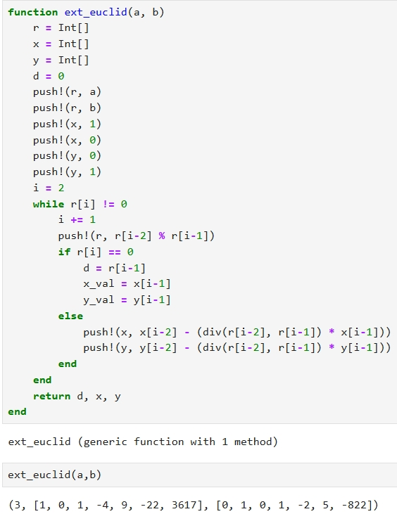
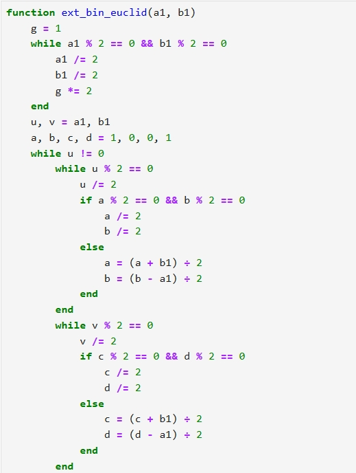
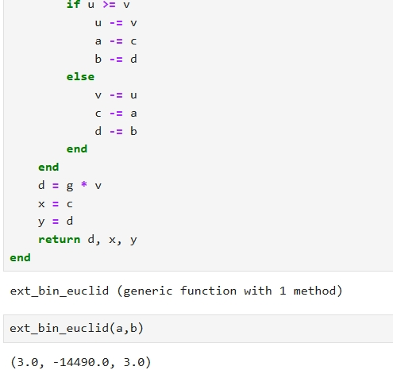

---
# Front matter
lang: ru-RU
title: Защита лабораторной работы №4
subtitle: Алгоритмы вычисления наибольшего общего делителя 
author: "Бармина Ольга"
institute: Российский университет дружбы народов, Москва, Россия
date: 2024 September 7th

# Formatting
toc: false
slide_level: 2
header-includes: 
 - \metroset{progressbar=frametitle,sectionpage=progressbar,numbering=fraction}
 - '\makeatletter'
 - '\beamer@ignorenonframefalse'
 - '\makeatother'
aspectratio: 43
section-titles: true
theme: metropolis

---

## Цель выполнения лабораторной работы

- Освоение алгоритмов вычисления наибольшего общего делителя
- Программная реализация алгоритмов вычисления НОД

## Теоретические сведения

Для любых целых чисел $a_1, a_2, ..., a_k$ существует наибольший общий делитель $d$ и его можно представить в виде *линейной комбинации* этих чисел:

$$d=c_1a_1+c_2a_2+...+c_ka_k, c_i \in Z (Z - множество целых чисел).$$

Например, НОД чисел 91, 105, 154 равен 7. В качестве линейного представления можно взять:
$$7=7*91+(-6)*105+0*154,$$
либо
$$7=4*91+1*105-3*154.$$

## Постановка задачи

Реализовать алгоритмы вычисления наибольшего общего делителя, такие как:
- Алгоритм Евклида
- Бинарный алгоритм Евклида
- Расширенный алгоритм Евклида
- Расширенный бинарный алгоритм Евклида

Исходные данные:
- a = 12345
- b = 54321

## Результат выполнения лабораторной работы

Вычисление НОД при помощи алгоритма Евклида:

{width=80%}

## Результат выполнения лабораторной работы

Вычисление НОД при помощи бинарного алгоритма Евклида:

{width=70%}

## Результат выполнения лабораторной работы

Вычисление НОД при помощи расширенного алгоритма Евклида:

{width=80%}

## Результат выполнения лабораторной работы

Вычисление НОД при помощи расширенного бинарного алгоритма Евклида:

{width=40%}

## Результат выполнения лабораторной работы

Вычисление НОД при помощи расширенного бинарного алгоритма Евклида:

{width=70%}

# Выводы

## Выводы

1. Изучили алгоритмы вычисления наибольшего общего делителя
2. Реализовали алгоритмы вычисления НОД
