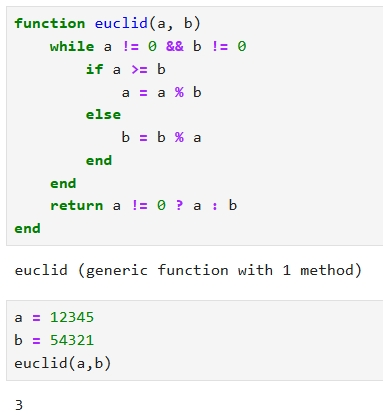

---
# Front matter
title: "Отчет по лабораторной работе №4"
subtitle: "Вычисление наибольшего общего делителя"
author: "АБармина Ольга Константиновна"
institute: Российский университет дружбы народов, Москва, Россия
date: 2024 September 7th

# Generic otions
lang: ru-RU
toc-title: "Содержание"

# Pdf output format
toc: true # Table of contents
toc_depth: 2
lof: true # List of figures
fontsize: 12pt
linestretch: 1.5
papersize: a4
documentclass: scrreprt
### Fonts
mainfont: PT Serif
romanfont: PT Serif
sansfont: PT Sans
monofont: PT Mono
mainfontoptions: Ligatures=TeX
romanfontoptions: Ligatures=TeX
sansfontoptions: Ligatures=TeX,Scale=MatchLowercase
monofontoptions: Scale=MatchLowercase,Scale=0.9
## Biblatex
biblatex: true
biblio-style: "gost-numeric"
biblatexoptions:
  - parentracker=true
  - backend=biber
  - hyperref=auto
  - language=auto
  - autolang=other*
  - citestyle=gost-numeric
## Misc options
indent: true
header-includes:
  - \linepenalty=10 # the penalty added to the badness of each line within a paragraph (no associated penalty node) Increasing the value makes tex try to have fewer lines in the paragraph.
  - \interlinepenalty=0 # value of the penalty (node) added after each line of a paragraph.
  - \hyphenpenalty=50 # the penalty for line breaking at an automatically inserted hyphen
  - \exhyphenpenalty=50 # the penalty for line breaking at an explicit hyphen
  - \binoppenalty=700 # the penalty for breaking a line at a binary operator
  - \relpenalty=500 # the penalty for breaking a line at a relation
  - \clubpenalty=150 # extra penalty for breaking after first line of a paragraph
  - \widowpenalty=150 # extra penalty for breaking before last line of a paragraph
  - \displaywidowpenalty=50 # extra penalty for breaking before last line before a display math
  - \brokenpenalty=100 # extra penalty for page breaking after a hyphenated line
  - \predisplaypenalty=10000 # penalty for breaking before a display
  - \postdisplaypenalty=0 # penalty for breaking after a display
  - \floatingpenalty = 20000 # penalty for splitting an insertion (can only be split footnote in standard LaTeX)
  - \raggedbottom # or \flushbottom
  - \usepackage{float} # keep figures where there are in the text
  - \floatplacement{figure}{H} # keep figures where there are in the text
---

# Цель работы

Целью данной работы является освоение алгоритмов вычисления наибольшего общего делителя.

# Задание

1. Изучить методы вычисления наибольшего общего делителя.
2. Реализовать алгоритмы вычисления НОД.

# Теоретическое введение

Пусть числа $a$ и $b$ целые и $b\neq 0$. Разделить $a$ на $b$ с остатком - значит представить $a$ в виде $a=qb+r$, где $q,r \in Z$ и $0 \leqslant r \leqslant \mid b \mid$. Число $q$ называется неполным частным, число $r$ - неполным остатком от деления $a$ на $b$.

Целое число $d \neq 0$ называется *наибольшим общим делителем* целых чисел $a_1, a_2, ..., a_k$ (обозначается $d=НОД(a_1, a_2, ..., a_k)$), если выполняются следующие условия:

1. Каждое из чисел $a_1, a_2, ..., a_k$ делится на $d$;
2. Если $d_1 \neq 0$ - другой общий делитель чисел $a_1, a_2, ..., a_k$, то $d$ делится на $d_1$. [1]
# Ход выполнения лабораторной работы

Работа выполняется на языке программирования Python с использованием среды Google Colab

1. Реализуем алгоритм Евклида:

{width=80%}

2. Реализуем бинарный алгоритм Евклида:

{width=80%}

3. Реализуем расширенный алгоритм Евклида:

{width=80%}

5. Реализуем расширенный бинарный алгоритм Евклида:

{width=80%}

{width=80%}

# Выводы

В ходе работы мы изучили и реализовали алгоритмы вычисления наибольшего общего делителя.

# Список литературы

1. Методические материалы курса
