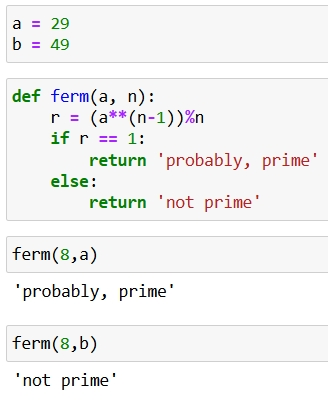
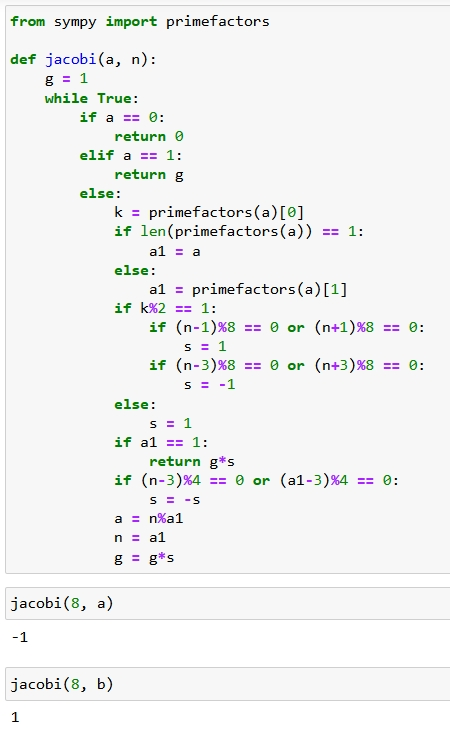
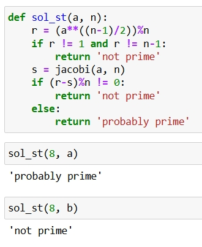
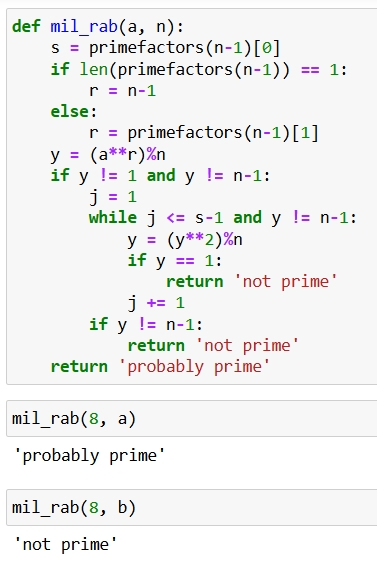

---
## Front matter
title: "Отчет по лабораторной работе №5"
subtitle: "Вероятностные алгоритмы проверки чисел на простоту"
author: "Бармина Ольга Константиновна"
institute: Российский университет дружбы народов, Москва, Россия
date: 2024 September 7th

# Generic otions
lang: ru-RU
toc-title: "Содержание"

# Pdf output format
toc: true # Table of contents
toc_depth: 2
lof: true # List of figures
fontsize: 12pt
linestretch: 1.5
papersize: a4
documentclass: scrreprt
### Fonts
mainfont: PT Serif
romanfont: PT Serif
sansfont: PT Sans
monofont: PT Mono
mainfontoptions: Ligatures=TeX
romanfontoptions: Ligatures=TeX
sansfontoptions: Ligatures=TeX,Scale=MatchLowercase
monofontoptions: Scale=MatchLowercase,Scale=0.9
## Biblatex
biblatex: true
biblio-style: "gost-numeric"
biblatexoptions:
  - parentracker=true
  - backend=biber
  - hyperref=auto
  - language=auto
  - autolang=other*
  - citestyle=gost-numeric
## Misc options
indent: true
header-includes:
  - \linepenalty=10 # the penalty added to the badness of each line within a paragraph (no associated penalty node) Increasing the value makes tex try to have fewer lines in the paragraph.
  - \interlinepenalty=0 # value of the penalty (node) added after each line of a paragraph.
  - \hyphenpenalty=50 # the penalty for line breaking at an automatically inserted hyphen
  - \exhyphenpenalty=50 # the penalty for line breaking at an explicit hyphen
  - \binoppenalty=700 # the penalty for breaking a line at a binary operator
  - \relpenalty=500 # the penalty for breaking a line at a relation
  - \clubpenalty=150 # extra penalty for breaking after first line of a paragraph
  - \widowpenalty=150 # extra penalty for breaking before last line of a paragraph
  - \displaywidowpenalty=50 # extra penalty for breaking before last line before a display math
  - \brokenpenalty=100 # extra penalty for page breaking after a hyphenated line
  - \predisplaypenalty=10000 # penalty for breaking before a display
  - \postdisplaypenalty=0 # penalty for breaking after a display
  - \floatingpenalty = 20000 # penalty for splitting an insertion (can only be split footnote in standard LaTeX)
  - \raggedbottom # or \flushbottom
  - \usepackage{float} # keep figures where there are in the text
  - \floatplacement{figure}{H} # keep figures where there are in the text
---

# Цель работы

Цель данной работы: научиться реализовывать алгоритмы проверки чисел на простоту.

# Задание

1. Реализовать алгоритмы проверки чисел на простоту.

# Теоретическое введение

Пусть а - целое число. Числа ‡1, ‡а называются тривиальными делителями числа а.
Целое число р €Z/{0) называется простым, если оно не является делителем единицы и не имеет других делителей, кроме тривиальных. В противном случае число p €Z/{-1, 0, 1) называется составным.

# Выполнение лабораторной работы

1. Прописываем функцию для алгоритма теста Ферма  (рис. @fig:001).

{#fig:001 width=70%}

2. Прописывается функция для алгоритма вычисления символа Якоби. (рис. @fig:002).

{#fig:002 width=70%}

3. Программная реализация алгоритма Соловэй-Штрассена.  (рис. @fig:003).

{#fig:003 width=70%}

4. Программная реализация алгоритма Миллера-Рабина. (рис. @fig:004).

{#fig:004 width=70%}

# Выводы

В ходе работы были реализованы алгоритмы проверки чисел на простоту.

# Список литературы

1. Методические материалы курса
