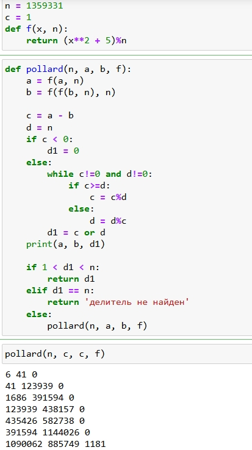

---
# Front matter
lang: ru-RU
title: Защита лабораторной работы №6
subtitle: Разложение чисел на множители 
author: "Бармина Ольга"
institute: Российский университет дружбы народов, Москва, Россия
date: 2024 September 7th

# Formatting
toc: false
slide_level: 2
header-includes: 
 - \metroset{progressbar=frametitle,sectionpage=progressbar,numbering=fraction}
 - '\makeatletter'
 - '\beamer@ignorenonframefalse'
 - '\makeatother'
aspectratio: 43
section-titles: true
theme: metropolis

---

## Цель выполнения лабораторной работы

- Освоение *p-метода Полларда*, который является одним из алгоритмом разложения составного числа на множители
- Программная реализация представленного алгоритма разложения заданного числа на множители

## Теоретические сведения

Задача разложения на множители - одна из первых задач, использованных для построения криптосистем с открытым ключом.

*Задача разложения составного числа на множители*: для данного положительного целого числа *n* найти его разложение на два *нетривиальных сомножителя*: 

$$n = pq, 1 \leqslant p \leqslant q < n$$

## Алгоритм, реализующий р-метод Полларда

*Вход*. Число $n$, начальное значение $c$, функция $f$, обладающая сжимающими свойствами.

*Выход*. Нетривиальный делитель числа $n$.

- положить $a \leftarrow c$, $b \leftarrow c$
- вычислить $a \leftarrow f(a)$($mod$ $n$), $b \leftarrow f(b)$($mod$ $n$)
- найти $d \leftarrow НОД(a-b, n)$
- если $1<d<n$, то положить $p \leftarrow d$ и результат: $p$. При $d=n$ результат: "Делитель не найден"; при $d=1$ вернуться на шаг 2

## Результат выполнения лабораторной работы

Постановка задачи:

- Реализовать алгоритм разложения числа на множители с помощью р-метода Полларда
- Разложить на множители заданное число

## Результат выполнения лабораторной работы

Алгоритм, реализующий р-метод Полларда:

{width=35%}

# Выводы

## Выводы

1. Изучили метод Полларда разложения чисел на множители
2. Программно реализовали представленный алгоритм разложения чисел на множители
3. Разложили на множители заданное число
