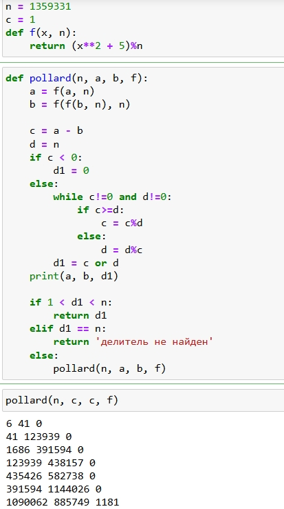

---
# Front matter
title: "Отчет по лабораторной работе №6"
subtitle: "Разложение чисел на множители"
author: "Бармина Ольга Константиновна"
institute: Российский университет дружбы народов, Москва, Россия
date: 2024 September 7th

# Generic otions
lang: ru-RU
toc-title: "Содержание"

# Pdf output format
toc: true # Table of contents
toc_depth: 2
lof: true # List of figures
fontsize: 12pt
linestretch: 1.5
papersize: a4
documentclass: scrreprt
### Fonts
mainfont: PT Serif
romanfont: PT Serif
sansfont: PT Sans
monofont: PT Mono
mainfontoptions: Ligatures=TeX
romanfontoptions: Ligatures=TeX
sansfontoptions: Ligatures=TeX,Scale=MatchLowercase
monofontoptions: Scale=MatchLowercase,Scale=0.9
## Biblatex
biblatex: true
biblio-style: "gost-numeric"
biblatexoptions:
  - parentracker=true
  - backend=biber
  - hyperref=auto
  - language=auto
  - autolang=other*
  - citestyle=gost-numeric
## Misc options
indent: true
header-includes:
  - \linepenalty=10 # the penalty added to the badness of each line within a paragraph (no associated penalty node) Increasing the value makes tex try to have fewer lines in the paragraph.
  - \interlinepenalty=0 # value of the penalty (node) added after each line of a paragraph.
  - \hyphenpenalty=50 # the penalty for line breaking at an automatically inserted hyphen
  - \exhyphenpenalty=50 # the penalty for line breaking at an explicit hyphen
  - \binoppenalty=700 # the penalty for breaking a line at a binary operator
  - \relpenalty=500 # the penalty for breaking a line at a relation
  - \clubpenalty=150 # extra penalty for breaking after first line of a paragraph
  - \widowpenalty=150 # extra penalty for breaking before last line of a paragraph
  - \displaywidowpenalty=50 # extra penalty for breaking before last line before a display math
  - \brokenpenalty=100 # extra penalty for page breaking after a hyphenated line
  - \predisplaypenalty=10000 # penalty for breaking before a display
  - \postdisplaypenalty=0 # penalty for breaking after a display
  - \floatingpenalty = 20000 # penalty for splitting an insertion (can only be split footnote in standard LaTeX)
  - \raggedbottom # or \flushbottom
  - \usepackage{float} # keep figures where there are in the text
  - \floatplacement{figure}{H} # keep figures where there are in the text
---

# Цель работы

Целью данной работы является освоение *p-метода Полларда*, который является одним из алгоритмом разложения составного числа на множители.

# Задание

1. Изучить алгоритм разложения чисел на множители.
2. Реализовать представленный алгоритм и разложить на множители заданное число.

# Теоретическое введение

Задача разложения на множители - одна из первых задач, использованных для построения криптосистем с открытым ключом.

*Задача разложения составного числа на множители* формулируется следующим образом: для данного положительного целого числа *n* найти его каноническое разложение $n = p_1^{\alpha _1} p_2^{\alpha _2} ... p_s^{\alpha _s}$, где $p_i$ - попарно различные простые числа, $\alpha _i \geqslant 1$.

На практике не обязательно находить каноническое разложение числа *n*. Достаточно найти его разложение на два *нетривиальных сомножителя*: $n = pq, 1 \leqslant p \leqslant q < n$. Далее будем понимать задачу разложения именно в этом смысле.

*p-Метод Полларда*. Пусть *n* - нечетное составное число, $S = {0,1,...,n-1}$ и $f: S \to S$ - случайное отображение. обладающее сжимающими свойствами. например. $f(x) \equiv x^2 + 1$ ($mod$ $n$). Основная идея метода состоит в следующем. Выбираем случайный элемент $x_0 \in S$ и строим последовательность $x_0, x_1, x_2, ...$, определяемую рекуррентным соотношением

$$x_{i+1} = f(x_i),$$

где $i \geqslant 0$, до тех пор, пока не найдем такие числа $i,j$, что $i < j$ и $x_i = x_j$. Поскольку множество $S$ конечно, такие индексы $i,j$ существуют (последовательность "зацикливается") [[2]](https://esystem.rudn.ru/pluginfile.php/2089897/mod_folder/content/0/mathsec_lection12-message-integrity-authentication.pdf?forcedownload=1). Последовательность $\lbrace x_i \rbrace$ будет состоять из "хваста" $x_0, x_1, ..., x_{i-1}$ длины $O \left(\sqrt{\frac{\pi n}{8}} \right)$ и цикла $x_i = x_j, x_{i+1}, ..., x_{j-1}$ той же длины.

# Выполнение лабораторной работы

Для реализации рассмотренного алгоритма разложения чисел на множители используется среда Google Colab.

1. Запишем алгоритм, реализующий *р-метод Полларда*. Проверим корректность работы алгоритма для заданных сведений. Для этого запишем условие примера с помощью следующей функции:

При вызове данной функции видим, что получаем то же число, что было описано в примере. То есть $1181$ является нетривиальным делителем числа $1359331$.

{width=80%}

# Выводы

В ходе работы мы изучили и реализовали вероятностные алгоритмы проверки чисел на простоту.

# Список литературы

1. Фороузан Б. А. Криптография и безопасность сетей. - М.: Интернет-Университет Информационных Технологий : БИНОМ. Лаборатория знаний, 2010. - 784 с. [[1]](https://intuit.ru/studies/courses/552/408/lecture/9350)

2. Методические материалы курса [[2]](https://esystem.rudn.ru/pluginfile.php/2089897/mod_folder/content/0/mathsec_lection12-message-integrity-authentication.pdf?forcedownload=1)
